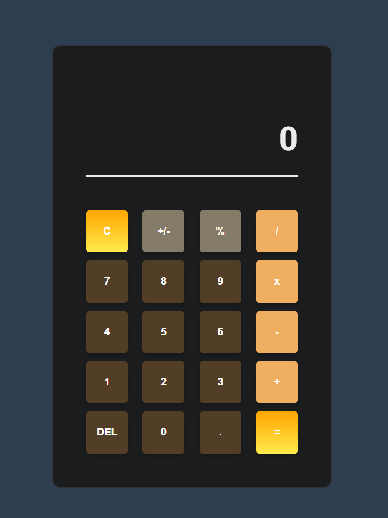

# Calculator
A fully functional web calculator that performs basic arithmetic operations with keyboard and mouse support, featuring expression history and smart input handling. This project is part of [The Odin Project's Foundations course](https://www.theodinproject.com/lessons/foundations-calculator).

## Screenshot

  

## Live Demo
🧮 [Try the Calculator](https://erclx.github.io/calculator/)

## Key Technologies & Concepts
• JavaScript  
• HTML/CSS  
• DOM Manipulation  
• Event Listeners  
• Array Methods  
• Order of Operations (PEMDAS)  
• CSS Grid/Flexbox  
• State Management
